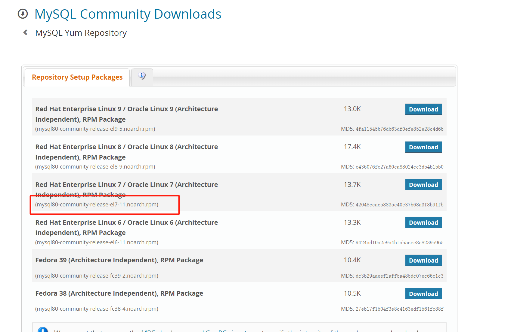
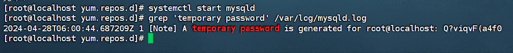

## 一.mysql安装

### 1. [mysql](https://dev.mysql.com/downloads/repo/yum/)rpm包路径

```
// 复制 mysql rpm路径 
mysql80-community-release-el7-11.noarch.rpm
```
### 2. 安装刚刚找到的rpm
```
yum -y install https://repo.mysql.com//mysql80-community-release-el7-11.noarch.rpm
```

### 3. 更新yum库
```
yum makecache
```

### 4. yum安装mysql
```
yum yum install -y mysql-community-server
```

### 5. 开启mysql，查看mysql状态
```
开启mysql，查看mysql状态
systemctl start mysqld    #开启MySQL
systemctl status mysqld   #查看MySQL状态
```


### 6. 获取MySQL临时密码
```
grep 'temporary password' /var/log/mysqld.log
```



### 7. 使用临时密码先登录
```
mysql -uroot -p
```
### 8. 修改MySQL密码(复杂密码，符合规则要求)
```
// 查看 mysql 初始的密码策略
SHOW VARIABLES LIKE 'validate_password%';

// 首先需要设置密码的验证强度等级，设置 validate_password.policy 的全局参数为 LOW 即可
set global validate_password.policy=LOW; 

// 当前密码长度为 8 ，如果不介意的话就不用修改了，比如设置为 6 位的密码，设置validate_password_length 的全局参数为 6 即可
set global validate_password.length=6; 

//修改root账户密码
    ALTER USER 'root'@'localhost' IDENTIFIED BY '123456';
//如果上面那个命令不行
    ALTER USER 'root'@'%' IDENTIFIED WITH mysql_native_password BY '123456';
```

### 9. 开放远程权限
```
use mysql;  #选择mysql数据库
update user set host = '%' where user ='root';  #开放远程权限
flush privileges;  #刷新立即生效
```

### 10. 重启MySQL 关闭防火墙或者开放3306端口
```
systemctl restart mysqld   #重启MySQL

    systemctl stop firewalld   #关闭防火墙 
或
    firewall-cmd --zone=public --add-port=3306/tcp --permanent #开放3306端口
    systemctl restart firewalld   #重启
```

### 11. 设置开机自启
```
systemctl enable mysqld    #设置开机启动            
systemctl daemon-reload    #重新加载
```

### 12.忘记密码处理
```
1.更改/etc/my.cnf文件
    vi /etc/my.cnf
    增加 skip-grant-tables 
2.重启mysql
    service mysqld restart
3.使用用户无密码登录
    mysql -uroot -p (直接点击回车，密码为空)
4.清空密码
    update user set authentication_string='' where user='root';
5.退出
    quit
6.删除免密码登录代码“skip-grant-tables”，并重启MySQL
    service mysqld restart
7.重置密码
    mysql -uroot -p (直接点击回车，密码为空)
    //修改root账户密码
    ALTER USER 'root'@'localhost' IDENTIFIED BY '123456';
    //如果上面那个命令不行
    ALTER USER 'root'@'%' IDENTIFIED WITH mysql_native_password BY '123456';
8.重启mysql
    service mysqld restart           
```


## 二.卸载
```
#停止mysql服务
systemctl stop mysqld  

#使用 rpm 命令查看已安装的安装包
rpm -qa|grep mysql 

#移除所有安装包 查出来的所有包名
# yum -y remove 包名
yum -y remove mysql-community-server-8.0.32-1.el7.x86_64 

#第二步所有查出来的包都需要逐个移除，直到rpm -qa |grep mysql查不出来与mysql相关的包
rpm -qa|grep mysql

#检查是否卸载成功
rpm -ql mysql

#彻底删除残留文件
find / -iname mysql| xargs -n 1000 rm -rf
```


## 三.mysql常用命令
```
# 启动
systemctl start mysqld

# 第一次启动后，可以查看mysql初始化密码
grep 'temporary password' /var/log/mysqld.log

# 重启
systemctl restart mysqld

# 停止
systemctl stop mysqld

#查看状态
systemctl status mysqld

#开机启动
systemctl enable mysqld
systemctl daemon-reload

# 查看进程、版本信息
ps -ef | grep mysql
或
netstat -atp

# 登录
mysql -u root -p'密码内容'

# 查看所有表
show databases;

# 进入数据库
use 表名

# 查看所有表
show tables

# 查看某张表信息
desc 表名

# 查
select * from 表名
# 删
delete from 表名 where field=xx
# 改
update 表名 set field='xxx' where field='xxx';
```


