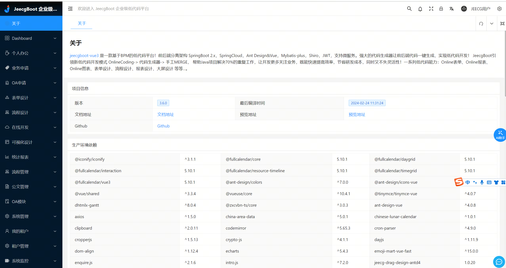
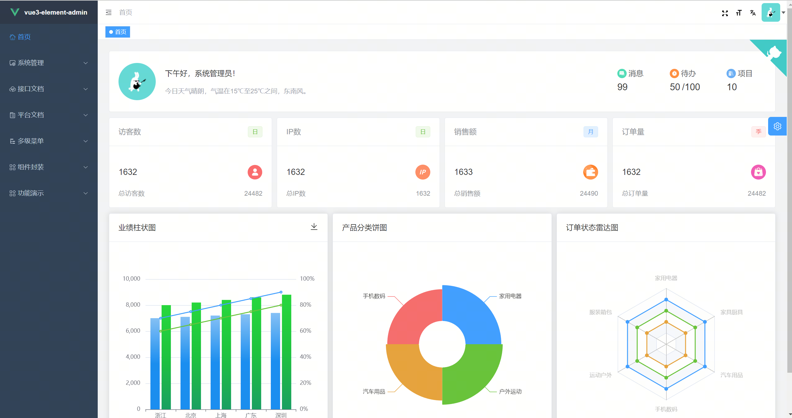
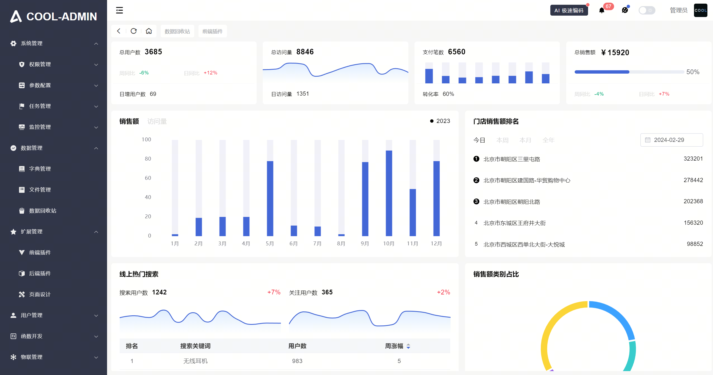

| 项目         | 主要技术 | 演示地址                                                | GitCode                                                      | 首页                  |
| ------------ | -------- | ------------------------------------------------------- | ------------------------------------------------------------ | --------------------- |
| 后台管理系统 | vue3     | [jeecg-boot](http://boot3.jeecg.com/dashboard/analysis) | [vue3-jeecg-boot](https://github.com/jeecgboot/jeecgboot-vue3) | 
  
 |
| 后台管理系统 | vue3     | [youlai-boot](https://vue3.youlai.tech/#/dashboard)     | [youlai-boot](https://gitee.com/youlaiorg/vue3-element-admin) | 
  
  |
| 后台管理系统 | vue3     | [cool-admin](https://show.cool-admin.com/)     | [cool-admin](https://docs.cool-admin.com/admin/vue/introduce.html#%E4%BB%A3%E7%A0%81%E4%BB%93%E5%BA%93) | 
  
  |

